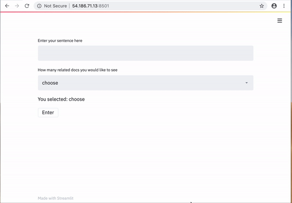

# Sentence-Embedding-for-Doccument-Ranking
This repository is the implelentation of building a document ranking and retrieval system using the sentence embedding tailored for your sepecial corpus. 

It allows to you to train the sentence embedding system on your own unique corpus, create your own indexed document reposistory and buid a ranking system to  output the top K similar/relavant docs in the repository for a given input query.


## Demo:



## Getting Started:
Clone this reposistory locally and create a virtual enviroment(conda examples below)
```
git clone https://github.com/ffangsong/Sentence_Embedding_for_Ranking.git
cd Sentence_Embedding_for_Ranking
```

Create the environment file from the the provided requirement.txt file

    conda create python=3.6
    pip install -r requirement.txt
    
Make sure you have dataset in the ```data``` folder(you can specify the path in the bash script later)    


## Embedding Model Details
Two models can be trained to learn doc embeddings. 
* The first model leverages pretrained word embedding. The word embeddings were them fed into a LSTM layer to capture the long term dependency of the words and thus richer semantic informations. 
* The second model start with a Bert layer initialized with the pre-trained weights , followed by a pool layer and  and a drop out layey. During training, the Bert model was fine-tuned for the special input corpus. 

## Train model
* To train the word2vec_LSTM model, please download Google's pretrained model [here](https://s3.amazonaws.com/dl4j-distribution/GoogleNews-vectors-negative300.bin.gz) and put in the ```docs/pretrained``` folder. To start training:
```
cd src/
python word2vec_LSTM_train.py
```

* To fine tune the Bert model, please download pretrained Bert model [here](https://storage.googleapis.com/bert_models/2018_10_18/uncased_L-12_H-768_A-12.zip), unzip it and put in the ```docs/pretrained```. To start training

```
cd src/
python bert_fine_tune_train.py
```


## Indexing 

To generate the index, please put your docs you want to index at```data/ ```  and run:
```
python src/indexing.py
```
The index will be saved at ```docs/ ```


## Run Ranking test

To run test on the ranking application, please run:
```
python src/ranking.py
```

## More information about Word2Vec and BERT
Google's pretrained word2vec model includes word vectors for a vocabulary of 3 million words and phrases that they trained on roughly 100 billion words from a Google News dataset. The vector length is 300 features.

BERT builds on top of a number of clever ideas that have been responsible for many of the recent advances in NLP, including the transformer architecture and semi-supervized pre-training on large amounts of text(book, wikipedia,etc). BERT is pre-trained on two tasks: masked language modeling and next sentence prediction. It has language-processing abilities capable of empowering many models we later need to build and train in a supervised way.  
